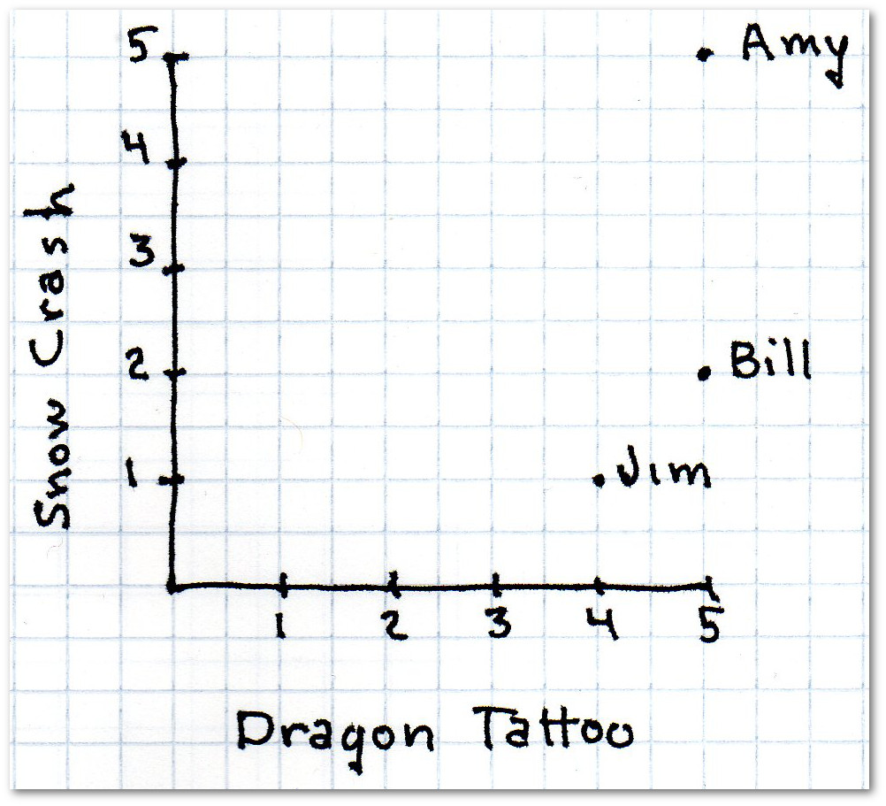
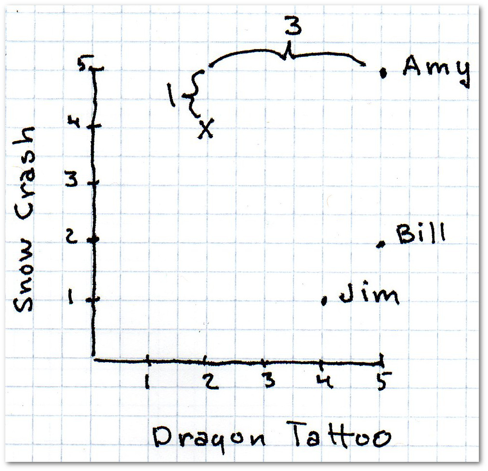

[[abc123]]
= Document Title
:doctype: book
:stem:
== Recommendation Systems

Chapter text begins here.

=== I like what you like

We are going to start our exploration of data mining by looking at recommendation systems. Recommendation systems are everywhere—from Amazon:

[[image2.1]]

aa

to last.fm recommending music or concerts:
[[image2.2]]

[[image2.3]]

In the Amazon example, above, Amazon combines two bits of information to make a recommendation. The first is that I viewed _The Lotus Sutra_ translated by Gene Reeves; the second, that customers who viewed that translation of _The Lotus Sutra_  also viewed several other translations.

The recommendation method we are looking at in this chapter is called collaborative filtering. It's called collaborative because it makes recommendations based on other people—in effect, people collaborate to come up with recommendations. It works like this. Suppose the task is to recommend a book to you. I search among other users of the site to find one that is similar to you in the books she enjoys. Once I find that similar person I can see what she likes and recommend those books to you—perhaps Paolo Bacigalupi's _The Windup Girl._

=== How do I find someone who is similar?

So the first step is to find someone who is similar.  Here's the simple 2D (dimensional) explanation. Suppose users rate books on a 5 star system—zero stars means the book is terrible, 5 stars means the book is great.  Because I said we are looking at the simple 2D case, we restrict our ratings to two books: Neal Stephenson's _Snow Crash_ and the Steig Larsson's The Girl with the _Dragon Tattoo._

[[image2.4]]

First, here's a table showing 3 users who rated these books

.A Customer Ratings
[options="header"]
|=======
|Customer|Snow Crash|Dragon Tatoo
|Amy|5|5
|Bill|3|4
|Jim|2|3
|=======

We would like to recommend a book to the mysterious Ms. X who rated _Snow Crash_ 5 stars and _The Girl with the Dragon Tattoo_ 2 stars.  The first task is to find the person who is most similar, or closest, to Ms. X.  We do this by computing distance.

==== Manhattan Distance

The easiest distance measure to compute is what is called Manhattan Distance or cab driver distance. In the 2D case, each person is represented by an (x, y) point. I will add a subscript to the x and y to refer to different people. So (x1, y1) might be Amy and (x2, y2) might be the elusive Ms. X. Manhattan Distance is then calculated by


[latexmath]
++++
\begin{equation}
{D_{Manhattan} = | x_1 - x_2 | + | y_1 - y_2|}
\end{equation}

++++

latexmath:[$D_{Manhattan} = | x_1 - x_2 | + | y_1 - y_2|$]

The vertical bars means *absolute value* meaning the value of the number regardless of its sign. So

latexmath:[| 1 - 2 | = | -1 | = 1]

Think of the distance as how cars drive around Manhattan streets. They don't travel as the crow flies (that would be Euclidean distance). The Manhattan Distance for Amy and Ms. X is 4:

FIX
[[image2.5]]

Computing the distance between Ms. X and all three people gives us:


.Manhattan Distance to Ms. X
[options="header"]
|=======
|Customer|distance to Ms.X
|Amy|3
|Bill|4
|Jim|4
|=======

Amy is the closest match. We can look in her history and see, for example,  that she gave five stars to Paolo Bacigalupi's _The Windup Girl_ and we would recommend that book to Ms. X.

==== Euclidean Distance

One benefit of Manhattan Distance is that it is fast to compute. If we are Facebook and are trying to find who among one million users is most similar to little Danny from Kalamazoo, fast is good.

*Pythagorean Theorem*

You may recall the Pythagorean Theorem from your distant educational past.

[latexmath]
++++
\begin{equation}
{c=\sqrt{a^2+b^2}}
\end{equation}

++++

Euclidean distance is the straight line distance between two points:

[latexmath]
++++
\begin{equation}
{D_{Euclidean} = \sqrt{(x_1 - x_2)^2 + (y_1 - y_2)^2}}
\end{equation}

++++
Here, instead of finding the Manhattan Distance between Amy and Ms. X (which was 4) we are going to figure out the straight line, as-the-crow-flies, distance. Recall that in our simple example, x1 is how well person 1 liked Dragon Tattoo and x2 is how well person 2 liked it; y1 is how well person 1 liked Snow Crash and y2 is how well person 2 liked it.

Amy rated both Snow Crash and Dragon Tattoo a 5; The elusive Ms. X rated Dragon Tattoo a 2 and Snow Crash a 5.  So the Euclidean distance between Amy and Ms. X is

[latexmath]
++++
\begin{equation}
{D_{Euclidean} = \sqrt{(5 - 5)^2 + (5 - 2)^2} = \sqrt{(0)^2 + (3)^2} = \sqrt{9} = 3}
\end{equation}

++++

.Euclidean Distance to Ms. X
[options="header"]
|=======
|Customer|distance to Ms.X
|Amy|3
|Bill|2
|Jim|3.16
|=======

This time the nearest neighbor to Ms. S is Bill. As you can see, different distance formulas may result in different nearest neighbors.

*N-dimensional thinking*

Let's branch out slightly from just looking at rating two books (and hence 2D) to looking at something slightly more complex. Suppose we work for an online streaming music service and we want to make the experience more compelling by recommending bands. Let's say users can rate bands on a star system 1-5 stars and they can give half star ratings (for example, you can give a band 2.5 stars). The following chart shows 8 users and their ratings of eight bands.

.Ratings of Eight Musical Artists
[options="header"]
|=======
|Customer|Portugal. The Man | Tycho | Tim McGraw | Hallee Steinfield | Metalica | Janelle Monáe | Keith Urban | Dua Lipa
|Colton    | 5 | 1 | 5 | 2 | 5 | 1 | 2 | 5
|Bryce     | 1 | 4 | 1 | 4 | 2 | 3 | 1 | 5
|Mikaela   | 3 | 5 | 5 | 5 | 1 | 2 | 5 | 2
|Rachel    | 4 | 4 | 3 | 4 | 2 | 2 | 3 | 4
|Abigail   | 4 | 5 | 1 | 5 | 1 | 3 | 2 | 5
|Tiffany   | 4 | 2 | 4 | 3 | 1 | 4 | 4 | 2
|Catherine | 2 | 5 | 1 | 3 | 1 | 5 | 2 | 4
|Gusty     | 4 | 4 | 3 | 4 | 2 | 5 | 2 | 4
|=======

Let's compute the Euclidean distance between Mikaela and Rachel. Mikaela rated _Portugal. The Man_ a 3 and Rachel rating that group a 4. So that's a distance of one. Mikaela rated Tycho a 5 and Rachel rated the group a 4 for a distance of 1. Here are all the distances:

.Euclidean Distance between Mikaela and Rachel
[options="header"]
|=======
|Customer|Portugal. The Man | Tycho | Tim McGraw | Hallee Steinfield | Metalica | Janelle Monáe | Keith Urban | Dua Lipa | TOTAL
|Mikaela     | 3 | 5 | 5 | 5 | 1 | 2 | 5 | 2 | -
|Rachel      | 4 | 4 | 3 | 4 | 2 | 2 | 3 | 4 | -
|_Distance_  | 1 | 1 | 2 | 1 | 1 | 0 | 2 | 2 | 10
|=======

That's computing a distance in 8 dimensions (because there were 8 musical artists our customers rated).

Let's use

[latexmath]
++++
\begin{equation}
{R_{p,a}}
\end{equation}

++++

to indicate person _p_'s rating of artist _a._

Then the formula for Manhattan Distance between persons _x_ and _y_ is

[latexmath]
++++
\begin{equation}
{Manhattan_{x,y}=\sum_{a=1}^N{|R_{x,a} - R_{y,a}|}}
\end{equation}
++++

This is what we computed above in our 8 musical artist example.

Then the formula for Euclidean Distance between persons _x_ and _y_ is

[latexmath]
++++
\begin{equation}
{Euclidean_{x,y}=\sqrt{\sum_{a=1}^N{(R_{x,a} - R_{y,a})^2}}}
\end{equation}
++++

[[image2.6]]

aa

.Sidebar Title
****
Sidebar text is surrounded by four asterisk characters above and below.
****

the end
